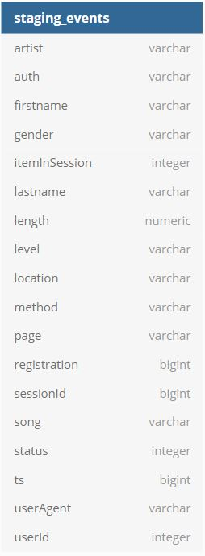
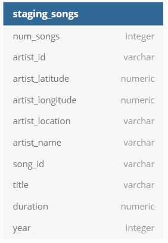
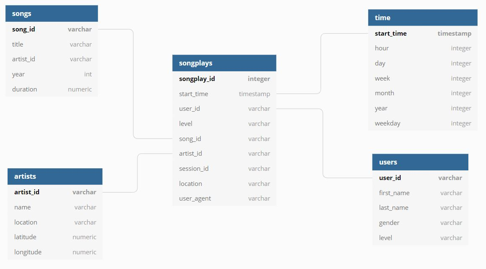

# Problem Description
Your company (Sparkify) has been collecting information about user acitivity and song data through your music streaming application. You have recently started to grow your user base and would like to move all data operations to a cloud based environment. Your activity and songs file currently reside in a AWS S3 bucket and are all stored in JSON format. You would like to use the data in these files to perform analytics to better understand your customers and drive decision making. However, due to the nature of the file structure and format, this currently is not a feasible task. Therefore, you would like this data to be stored in a cloud based datawarehouse so your analytics team can easily query and analyze the data.

# Solution
The files contained in this project will load all of the song and log files currently in your S3 bucket, extract the relevant information needed for analysis, and load them into staging tables in AWS Redshift. From there, your data will be transformed and loaded into dimensional tables that will be easily querable by your analytics team. This process is typically called ETL (extract, transform, load) which is why the main file used for the data ingesting and loading in the project is named 'etl.py'. Along with this ETL file, you will find 'create_tables.py' and 'sql_queries.py' which contain the code necessary to create and update the tables.

# Using the files
In order to run this project, you will first need to create an AWS user account, assign that user an IAM role capable of reading data from S3, and create a Redshift cluster. The recommended size for the cluster would be 4 dc2.large instances. You will want to create this data warehouse in the same region as your S3 bucket for optimal performance and lowest cost. You will want to create a file named 'dwh.cfg' to store your AWS credentials, IAM role name, and file paths to your S3 data. See below for an example file structure.

[CLUSTER]
HOST=
DB_NAME=
DB_USER=
DB_PASSWORD=
DB_PORT=

[IAM_ROLE]
ARN=

[S3]
LOG_DATA=
LOG_JSONPATH=
SONG_DATA=

Once you have your cluster and dwh.cfg file created, you will want to start by running the 'create_tables.py'. This can be done using the command line. You will want to navigate to the project folder and run 'python create_tables.py' from the command line. This file will create the tables in which the data will be loaded. Once you have run that, you will want to run 'etl.py', again using the command line with the command 'python etl.py'. This step may take quite some time depending on the size and number of your data files. Should you make a mistake, you can run 'create_tables.py' again in order to drop the tables and re-create them.

***Make sure you always stop your Redshift cluster whenever you are not using it to save money.***

# Schema
### Staging tables

### Fact and dimension tables
