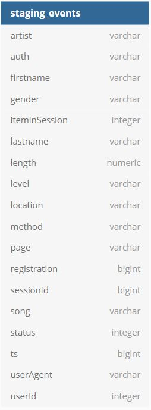
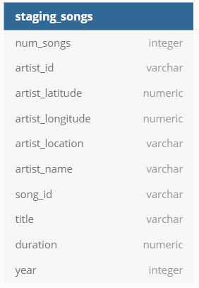
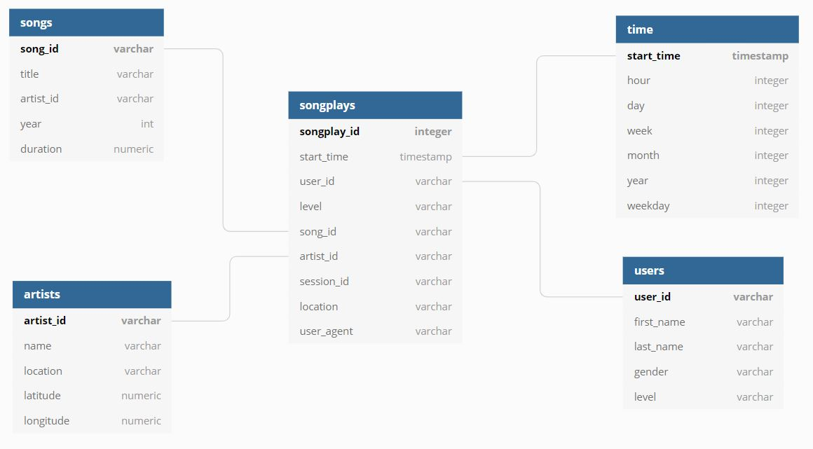

# Problem Description
Your company (Sparkify) has been collecting information about user acitivity and song data through your music streaming application. You have recently started to grow your user base and would like to move all data operations to a cloud based environment. Your activity and songs file currently reside in a AWS S3 bucket and are all stored in JSON format. You would like to use the data in these files to perform analytics to better understand your customers and drive decision making. However, due to the nature of the file structure and format, this currently is not a feasible task. Therefore, you would like this data to be processed using Spark and stored in a S3 bucket.

# Solution
The files contained in this project will load all of the song and log files currently in your S3 bucket, extract the relevant information needed for analysis, and load them into staging tables in AWS Redshift. From there, your data will be transformed and loaded into dimensional tables that will be easily querable by your analytics team. This process is typically called ETL (extract, transform, load) which is why the main file used for the data ingesting and loading in the project is named 'etl.py'. 

# Using the files
In order to run this project, you will first need to create an AWS user account, assign that user an IAM role capable of reading data from S3, and create a S3 bucket for storing the outpat. You will want to create this S3 bucket in the same region as your S3 bucket containing the json files for optimal performance and lowest cost. You will want to create a file named 'dl.cfg' to store your AWS credentials and file paths to your S3 data. See below for an example file structure.

[AWS]
AWS_ACCESS_KEY_ID=
AWS_SECRET_ACCESS_KEY=

[DATA]
SONG_DATA=
LOG_DATA=
OUTPUT_DATA=

Once you have your S3 output bucket and dl.cfg file created, you will want to run 'etl.py', again using the command line with the command 'python etl.py'. This step may take quite some time depending on the size and number of your data files. 

***Make sure you always stop you stop any running AWS sessions whenever you are not using it to save money.***

# Schema
### Staging tables

### Fact and dimension tables
